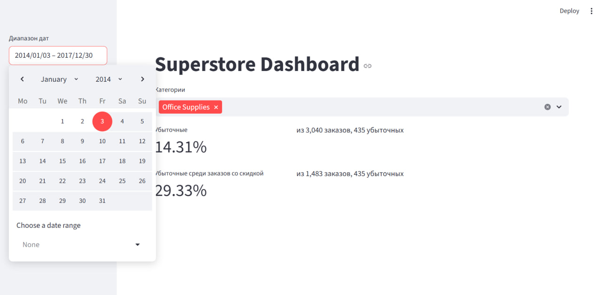
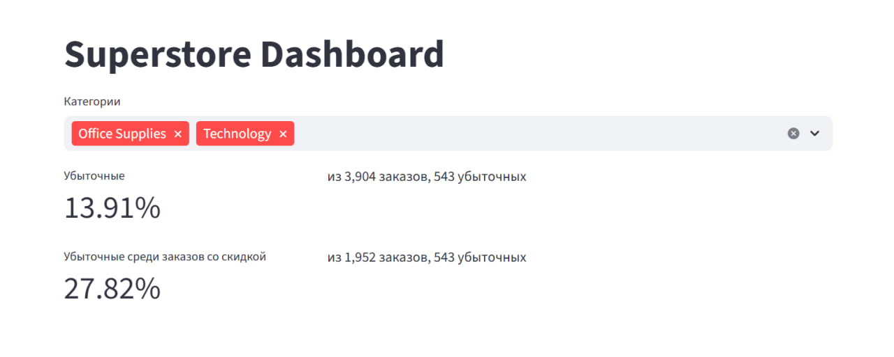

# Superstore Analysis

> Учебный пет-проект: анализ розничных продаж Sample Superstore,
> выявление зон убытка и влияния скидок.

---

## Цели проекта
- Отработать навыки EDA, SQL-аналитики, сборки дашборда (Streamlit).
- Понять где возникают убытки и как на это влияют скидки.
- Провести анализ и предложить действия по увеличению прибыли.

---

## Данные
В работе использовался публичный учебный датасет
[Superstore Dataset (Kaggle)](https://www.kaggle.com/datasets/vivek468/superstore-dataset-final)

Диапазон данных: 2014-01-03 - 2017-12-30

Структура данных:
````
Row ID => Уникальный идентификатор каждой строки.
Order ID => Уникальный идентификатор заказа для каждого клиента.
Order Date => Дата оформления заказа на товар.
Ship Date => Дата отгрузки товара.
Ship Mode => Режим доставки, указанный клиентом.
Customer ID => Уникальный идентификатор клиента.
Customer Name => Имя клиента.
Segment => Сегмент, к которому относится клиент.
Country => Страна проживания клиента.
City => Город проживания клиента.
State => Штат/область проживания клиента.
Postal Code => Почтовый индекс клиента.
Region => Регион, к которому относится клиент.
Product ID => Уникальный идентификатор товара.
Category => Категория заказанного товара.
Sub-Category => Подкатегория заказанного товара.
Product Name => Наименование товара.
Sales => Выручка по товару.
Quantity => Количество товара.
Discount => Предоставленная скидка.
Profit => Прибыль/убыток.
````
---
## Предварительная обработка данных
- Загрузила данные
- Убрала строки, где хотя бы одно из обязательных 
полей (Order ID, Order Date, Customer ID, Product ID, Sales) пустое
- Привела типы: даты (Order Date, Ship Date) → datetime c errors="coerce", числовые поля (Sales, Quantity, Discount, Profit, Postal Code) → numeric.
- Устранила дубликаты 
- Нормализовала текст: привела ключевые строковые поля к строковому типу и обрезала пробелы.
- Ввела для удобства дополнительные столбцы: Order Year, Order Month, Order Week 
- Сохранила очищенные данные в SQLite (data/db.sqlite, таблица orders)

---

## Технологии
- Python: pandas, SQLAlchemy, Pathlib, Streamlit.
- SQL (SQLite): подзапросы, CTE, именованные параметры (:date_from, :date_to), динамический IN для мультивыбора.
- Data/EDA: приведение типов, чистка пропусков/дубликатов, ABC-анализ, графики распределения по различным категориям
- Продуктовые метрики: KPI (Loss Rate + Discounted Loss Rate)
- Инженерия проекта: структура проекта, работа с путями (Path(__file__)).

---

## Структура проекта
````
project/
├─ data/                      
│  ├─db.sqlite                       # SQLite-база данных
│  └─Sample - Superstore.csv         # исходные данные
├─ sql/                              # аналитические SQL-запросы
│  ├─ 01_city_category_profit.sql    # распределение по городам и категориям
│  ├─ 02_ABC.sql                     # ABC анализ
│  └─ 03_KPI.sql                     # KPI Loss Rate среди всех и среди скидочных
├─ app/
│  └─ streamlit_app.py               # интерактивный дашборд
├─ notebooks/                        # черновые EDA/песочница
├─ media/                              
│  ├─ dashboard_kpi.png
│  └─ monthly_trend.png   
├─ src/                              
│  ├─ __init__.py
│  └─ load_clean.py                  # чистка данных
├─ tests/                            # проверки 
│  └─ test_load_clean.py
├─ README.md
├─ requirements.txt                  # требования
├─ .venv/                            
└─ .ipynb_checkpoints/               
````

---

## Проделанная работа
- Загружены и очищены данные, сохранены в SQLite.
- Проведён EDA:
  - тренды по времени и категориям
  - выявлена сезонность продаж
  - построена теплокарта (город × категория)
  - выявлены самые выгодные и невыгодные категории товаров
  - проанализированы подкатегории товаров по их степени влияния на продажи
- Реализован KPI Loss Rate и Loss Rate среди скидочных заказов.
- Собран Streamlit-дашборд: фильтры дат и категорий, KPI-плашки.
- Зафиксированы наблюдения и предложены действия по скидочной политике.

Ноутбук EDA: [notebooks/01_eda.ipynb](notebooks/01_eda.ipynb)

---
## Ключевые наблюдения

- Общий loss rate — 18.07% *(905 убыточных из 5 009 заказов)*.  
- Среди заказов со скидкой — 34.73% *(905 из 2 606)*: это +16.66 п.п. к общему и риск убыточности в 1.92× выше.  
- 100% убыточных заказов — со скидкой *(905/905)*.  
- Гипотеза: скидочная политика допускает убыточные заказы.  
- Действия:
  1) изменение скидочной политики так, чтобы она не допускала убыточных продаж
  2) ограничение скидок по категориям с высоким discounted loss rate;

<sub>Определение: *Loss rate* — доля заказов, у которых суммарная прибыль по Order ID отрицательна.</sub>

---

## Дашборд (Streamlit)
Функциональность:
- Фильтры: диапазон дат, мультивыбор категорий.
- KPI-плашки: Loss Rate и Loss Rate (со скидкой).

Скриншоты:



---

## Запуск
````
# 1) создать окружение
python -m venv venv
# Linux/macOS
source venv/bin/activate
# Windows (PowerShell)
# .\venv\Scripts\Activate.ps1

# 2) поставить зависимости
pip install -r requirements.txt

# 3) структура данных
# положи SQLite в data/db.sqlite (или укажи свой путь в app/streamlit_app.py)

# 4) запустить дашборд
streamlit run app/streamlit_app.py
````
--- 
## Requirements
pandas
sqlalchemy
streamlit
---